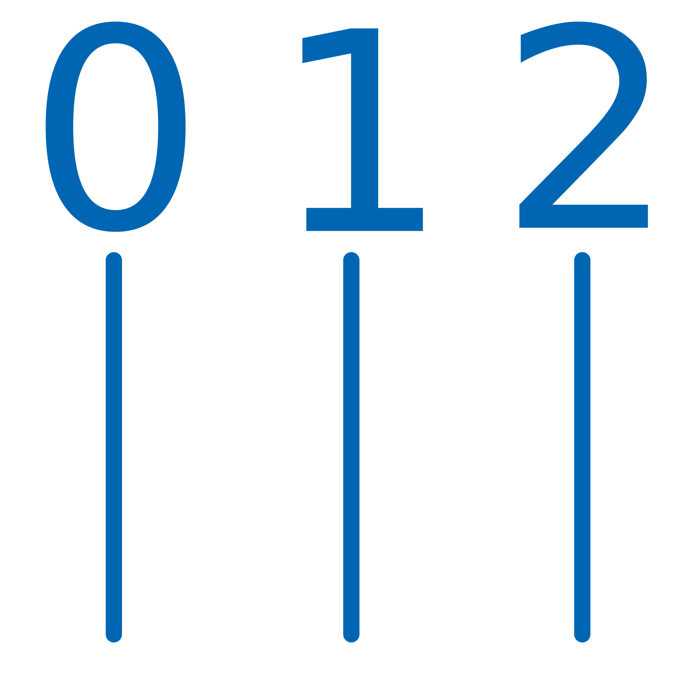

# Planix
Planix is a computer-aided design program that aims to use the LibreDWG library to read and write dwg files.

## Screen shots


## Features
- Read dwg files and show its information y a friendly data interface called data explorer.

### DATA Explorer interface
Here it is possible to see the data of the drawing in table format. There is also a selection menu by type of entity. It is possible to see the basic data such as layer, line type, color, weight and also some other especific data related to the type of entity, for example in the text entity it is possible to see its value, in the lines and polylines its length etc.

# Entities
| Icon | Alias | Name | Description |
|------|:-----:|:----:|------------:|
|  | l | Line | Create a line |
|  | po | Pline | Create a polyline |
|  | cv | Circle | Create a circle |
|  | a | Arc | Create an arc |
|  | ew | Ellipse | Create an ellipse |
|  | t | Text | Create a text |
|  | tt | Mtext | Create a mtext |
|  | at | atribute | Create an atribute definition |
|  | li | Leader | Create a leader |
|  | ii | Insert | Insert a block insert |
|  | b | block | Create a block |
|  | sq | Spline | Create an spline |
|  | sa | Solid | Create an solid |
|  | re | Rectangle | Create an rectangle |
|  | pl | polygon | Create a polygon |
|  | ht | Hatch | Create an hatch |
|  | pt | point | Create a point |
|  | ry | Rectangle | Create an ray trace |

# Dimensions
| Icon | Alias | Name | Description |
|------|:-----:|:----:|------------:|
|  | d0 | dimension_linear | Linear dimension |
|  | d1 | dimension_aligned | Aligned dimension |
|  | d2 | dimension_ang3pt | Angular dimension |
|  | d3 | arc_dimension | Arc lenght dimension |
|  | d4 | dimension_radius | Dimension radius |
|  | d5 | dimension_diameter | Dimension diameter |
|  | d6 | dimension_radius | Dimension large radial |
|  | d7 | ordinate_dimension | Dimension ordinate |


# Tools
| Icon | Alias | Name | Description |
|------|:-----:|:----:|------------:|
|  | m | Move | Move a site entity |
|  | c | Copy | Copy an entity |
|  | sc | Scale | Scale an entity |
|  | rt | Rotate | Rotate an entity |
|  | mn | Mirror | Create a new entity mirroring another |
|  | tr | Trim | Cut an entity |
|  | f | Fillet | Create a tangential arc to two lines |
|  | cd | Chamfer | Create a chamfer from two lines |
|  | ar | Array | Create a patern, it could be rectangular or polar |
|  | s | Stretch | Stretch an entity |
|  | fg | Offset | Create a parallel entity |
|  | dz | Divide | Divide an entity |
|  | bg | Break | Brak a entity in two parts |
|  | e | Extend | Stretch an entity from one end |
|  | de | erase | Delete an entity |

# Inquiry
| Icon | Alias | Name | Description |
|------|:-----:|:----:|------------:|
|  | mh | area | Meassure area |
|  | mj | ruler | Measure distance |
|  | mk | protractos | Measure angle |

# View
| Icon | Alias | Name | Description |
|------|:-----:|:----:|------------:|
|  | zc | Pan | Displacement of sight |
|  | zx | Zoome | View fit to all entities |
|  | z | Zoomw | View window |

# Layers
| Icon | Alias | Name | Description |
|------|:-----:|:----:|------------:|
|  | lk | Layers |  |

# Locks
| Icon | Key | Name | Description |
|------|:-----:|:----:|------------:|
|  | F1 | Help |  |
|  | F2 | Spare |  |
|  | F3 | Spare |  |
|  | F4 | Spare |  |
|  | F5 | Spare |  |
|  | F6 | Bounds | Enable or disable the bounds in drawing |
|  | F7 | Grid | Enable or disable the grid in screen |
|  | F8 | Ortho | Enable or disable the orthogonal mode |
|  | F9 | Spare |  |
|  | F10 | Spare |  |
|  | F11 | Spare |  |
|  | F12 | Spare |  |

## Contact
info@belmotek.com

## LibreDWG  project
LibreDWG - free implementation of the DWG file format, is a free C library to read and write DWG files. This program is part of the GNU project, released under the aegis of GNU. It is licensed under the terms of the GNU General Public License version 3 (or at you option any later version).
[https://www.gnu.org/software/libredwg/](URL)

### Install
```bash
    #!/bin/bash
    # Script para instalar LibreDWG en el sistema
    #===============================================================================
    # LibDWG
    git clone git://git.sv.gnu.org/libredwg.git
    cd libredwg
    sh autogen.sh
    ./configure --enable-trace
    make
    sudo make install
    make check
    cd ..
```

## Gambas project
Gambas is a free development environment and a full powerful development platform based on a Basic interpreter with object extensions.
http://gambas.sourceforge.net/en/main.html